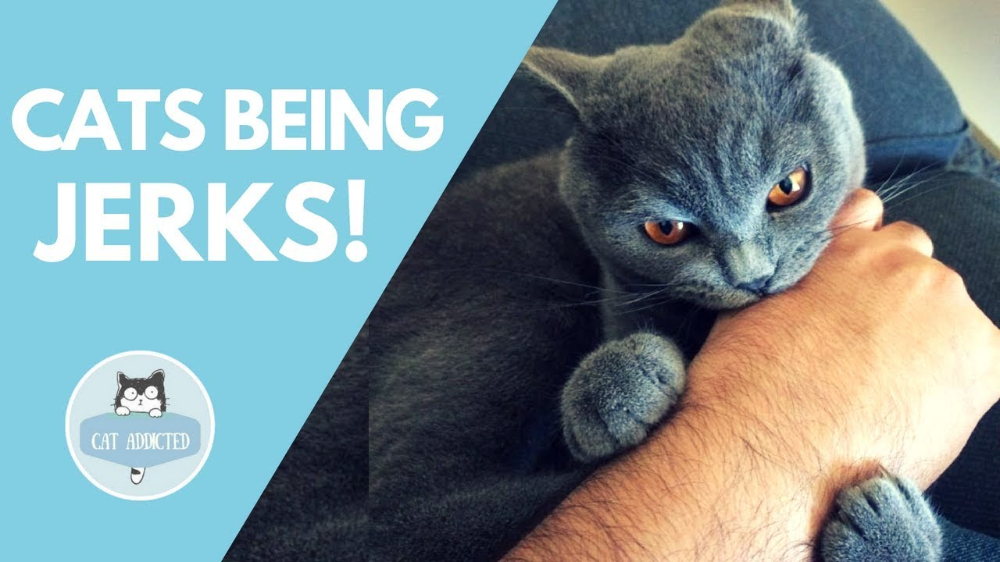

Bad news for all you cat lovers: That feline you are obsessed with is a total jerk. 

Sure, cats are cute, soft, lovable and an endless source of viral GIFs and memes, but in actuality, they kinda suck.Don't hate us for this blasphemy just yet. 

We understand your dilemma.Some people just love cats, and to be honest, we can't really blame them for that.Sure, cats are selfishly indifferent to your wellbeing,and in their minds you are their pets, not the other way around, but...look at the kitty! When you're over that adorable little ball of fuzz, maybe you'll be ready to come to terms with the fact that, even thought you adore your cat, it is a total jerk..

But They are amazing creatures!

***They Are Independent***

Cats can be left by themselves for a while. You can take a short vacation and leave them at home. All they need is enough food and water to make it through. They don’t get separation anxiety and tear up your entire house like dogs do.

***They Can Use the Bathroom***

Yeah, litter boxes can be gross, but they are much easier to deal with than poop scattered all over the house. Cats can even be taught to be potty trained on a real toilet. How cool is that?

***They Don't Need Exercise***

Cats don’t need to be taken on walks or let outside. All they need is to eat, sleep, and hang out. A lot of people don’t have time to be taking their pets on walks every day.

***They Are Good With Kids***

The majority of cats are good with kids and let kids carry them around. A few cats don't do well with kids, but you never have to worry about the kids getting injured or killed by a cat as you do with dogs.

***They Keep Quiet***

Cats are pretty quiet compared to dogs. Do you ever get annoyed when a dog’s barking wakes the whole house? You don’t have this problem with cats. Cats that are vocal never meow loud enough to cause a scene, and when you have visitors, they go off and hide rather than jump all over them.

***They Are Clean***

Cats bathe themselves and very rarely need a bath. They don’t smell bad either, like dogs do. You’ll see: After you pet a cat, you don’t feel like you need to wash your hands like crazy.

***They Can Be Inside Their Entire Lives***

Cats can stay inside their whole lives, and never get dirty and bring fleas and ticks into your home. You don’t have to worry about your pet getting attacked by a wild animal when they live inside.
They Are Natural Hunters

Cats are natural-born predators. Insects, bees, and spiders don’t have a chance with a cat. Cats pretty much exterminate pests from your house. You won't have a rat problem with a cat in your house. Hunting is a game for them.

***They Are Hilarious***

Cats are funny. Everyone has seen those millions of videos on YouTube featuring cats' hilarious behaviors. They are bigger celebrities than half of the people on the Internet.

***They Are Intuitive***

Cats have a clairvoyance about them. They can feel when you are upset, and they want to comfort you. Some cats know when someone is about to die. They are very emotional animals that love to be held and cuddled with.

They are so many reasons why cats are cool, but these are ones that stick out to me. Don’t get me wrong, I like dogs too, and I am in no way putting down dogs. But cats are the best for my lifestyle and me!
