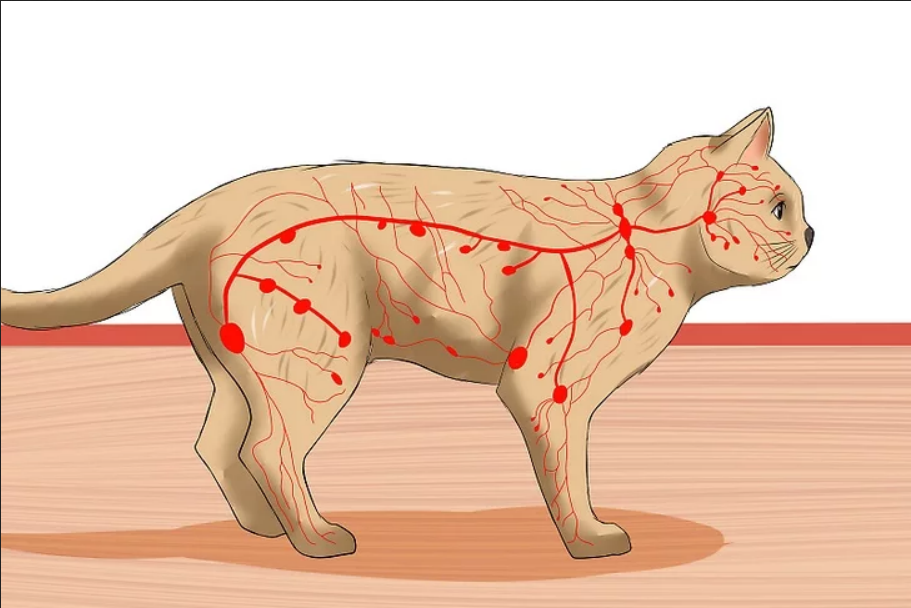

Cats are familiar and easily kept animals, and their physiology has been particularly well studied; it generally resembles those of other carnivorous mammals, but displays several unusual features probably attributable to cats' descent from desert-dwelling species.

***Heat tolerance***

Cats are able to tolerate quite high temperatures: Humans generally start to feel uncomfortable when their skin temperature passes about 38 °C (100 °F), but cats show no discomfort until their skin reaches around 52 °C (126 °F), 46  and can tolerate temperatures of up to 56 °C (133 °F) if they have access to water.

***Temperature regulation***

Cats conserve heat by reducing the flow of blood to their skin and lose heat by evaporation through their mouths. Cats have minimal ability to sweat, with glands located primarily in their paw pads, and pant for heat relief only at very high temperatures (but may also pant when stressed). A cat's body temperature does not vary throughout the day; this is part of cats' general lack of circadian rhythms and may reflect their tendency to be active both during the day and at night. 

***Water conservation***

Cats' feces are comparatively dry and their urine is highly concentrated, both of which are adaptations to allow cats to retain as much water as possible.  Their kidneys are so efficient, they can survive on a diet consisting only of meat, with no additional water. They can tolerate high levels of salt only in combination with freshwater to prevent dehydration.

***Ability to swim***

While domestic cats are able to swim, they are generally reluctant to enter water as it quickly leads to exhaustion.
