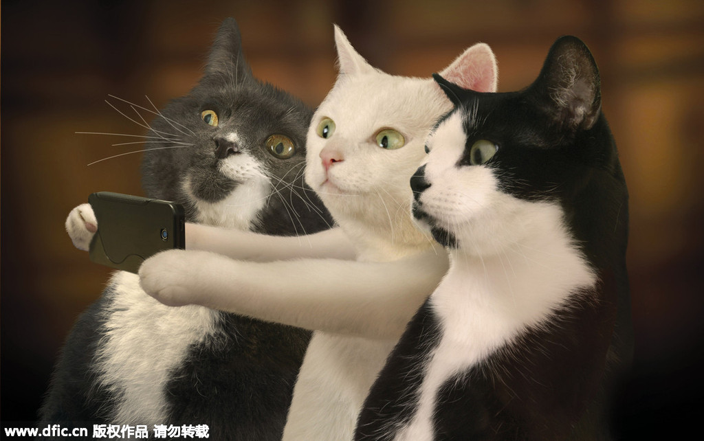

The Felidae or cat family are solitary predators and (with the exception of lions) do not live in socially structured groups.

However, while the wildcat ancestors of domestic cats are solitary animals, the social behaviour of domestic cats is more variable depending primarily on the density of cats and the availability of food sources. Our pet cat, Felis catus has proved to be a remarkably adaptable species, and while retaining its roots as a solitary hunter, in a number of situations (both natural and artificial) will adapt to group-living through the development of social structures. Broadly speaking, the living arrangements of free-living domestic cats can be divided into those in which females form small groups, loosely resembling a pride of lions, and those that remain solitary with individual territories (more typical of most wild felids).

***The importance of territory***

For a species where individuals are essentially solitary hunters, it is important for cats to establish a territory (ie hunting territory), and that this is defined in such a way as to generally avoid conflict with other cats (for the survival of the species). Cats, therefore, mark their territories using scent derived from facial glands, urine, faeces, and anal glands. This territorial marking, together with the extremely sensitive sense of smell, helps cats to communicate effectively and to minimise direct conflict between themselves.

A cat’s territory consists of a core area, or den, where it feels secure enough to sleep, eat, play and potentially enjoy social interaction. This forms the hub of the territory which is the area beyond the core area that the cat actively defends against invasion from others. Beyond this lies the home or hunting range that constitutes the extent of the area over which the cat will roam.

In the wild, territories may overlap with ‘neutral areas’ where cats may greet and interact with each other. If a strange cat encroaches into another cat’s territory, this will normally provoke an aggressive interaction to chase off the cat, firstly through staring, hissing and growling and, if that is not effective, through a short, noisy violent attack.

***Colony living***

Feral cats (cats which live without help from man) can and will form small colonies based around available food sources. This does not inevitably happen, and some will live singly, but it is not uncommon for small groups of co-operating females and kittens (matrilinear colonies) to develop. While there may be a very loose dominance hierarchy in these groups, the relationships are complex and they do not form an interdependent hierarchy as, for example, would occur in dogs. Relationships are complex, with stronger affiliative relationships between some cats and less affiliation with others – this may in part be influenced by how related they are, age, sex etc. However, they develop neither a social survival strategy nor a pack mentality and they continue to be solitary hunters. Thus cats are not ‘pack’ animals but have the ability to adapt to form social groups.

Where social groups of cats do exist, they appear only to work well when the members of the group are familiar and when there is no competition over food or other resources. Cats can form strong social relationships with familiar individuals, and particularly between kittens in the same litter and between kittens and their mother. However, in feral cat colonies, kittens may often be nursed (suckled) by more than one lactating queen, and this in itself may help in the formation of social bonds at a young age. Indeed kittens may also try to suck from non-lactating queens which may also help in the formation of social bonds.

There may be a larger ‘central’ colony of females associated with the major food source and smaller ‘peripheral’ groups that develop around the central colony that, while still have access to the food source, have poorer access, poorer health and poorer reproductive performance.

***Male cats***

Male cats are not commonly part of the small colonies, and they tend to exist on the periphery with large territories that may overlap several groups of females. The female groups/colonies generally have relatively more discrete and smaller territories although the size of female territories varies enormously, probably dependent largely on the abundance of food and the number/density of females in the group. Studies have suggested up to a 1000-fold variation in ‘home range’ size in different locations (eg, 0.27ha for a city-living feral cat in Jerusalem to 170ha for a cat in the Australian bush). Male territories may or may not overlap, but generally, there is considerable overlap (more so than between female groups) and their size is proportional to the availability of food and also the density of females present. Dominant males probably have larger territories, and in general, males may have a territory equivalent to, or up to 10 times larger, than that of the female groups (on average three times larger). The occurrence of numerous small groups of females not too widely dispersed appears to favour larger male territories.

***Aggression***

Aggression is not common within the female colonies – strong familiarity and relatedness between females help to keep aggression to a minimum. Aggression most commonly occurs as male kittens reach sexual maturity and are excluded from the group, or between males and females as the tom ‘patrols’ his territory. Toms are rarely aggressive towards females, but females, unless sexually receptive, will often be aggressive to males that wander too close. Nevertheless, amicable behaviour between females and toms will also occur (such as allogrooming and ‘greeting’ behaviour (tail up, sniff noses, rub heads), especially between females and males where there is considerable familiarity. Mature males interact differently, and this is usually characterised by agonistic interaction, avoidance or tolerance, and not by friendly interactions.

As cats have developed largely as solitary hunters without the need for complex social interactions, they appear to have relatively limited ability for complex visual signalling that occurs in many other animals that do exist in social groups. Thus they are less able to signal appeasement to other cats which means that in situations of conflict there is a much higher probability of fighting.