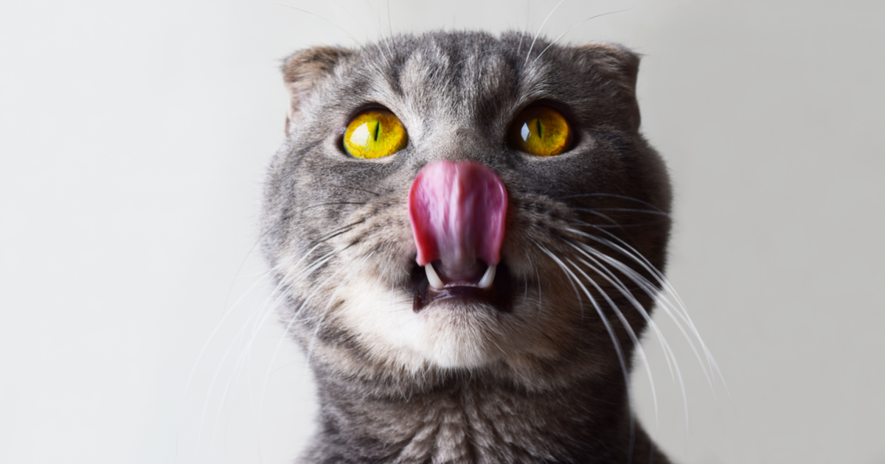

Cats are true masters of mystery. They let themselves be loved, but they act in a very particular way. Sometimes they make us understand that we have domesticated them, but at other times they make us see that we are the ones who are being domesticated for them. To understand them better, we can compare them with dogs: dogs always try to please us, always, whatever happens, on the contrary if you want to gain the trust of a feline, you must go little by little.

But there are still more things that make them unique. In this special I'm going to talk to you about 6 incredible curiosities about cats.

***1.- The message that licks on skin or hair hide***

How many times has it licked your skin or hair? Many? Few? In any case, you should know that this is more than enough reason to feel very good, very happy. Yes, yes, if you thought I was doing it just to clean you, you were wrong. Actually, I was grooming you. And he only groom someone (whether he has two legs or four legs) whom he truly considers an equal.

***2.- Lie on your back, the classic affectionate greeting***

And it is that when he lies down in that position, he has no way to defend himself, then of course, so that he is placed that way You have to be in front of someone whom you feel great appreciation and trust. 

***3.- You are part of their territory***

Not me, but its pheromones. The cat leaves its mark when it marks with its urine, but also when it rubs against something or someone with its face. This is the way you have to tell the rest of the family or fauna that is in the area that that part is yours. So every time he rubs on you, it'll be like telling you that you are part of it.

***4.- The meow is only for humans to pay attention to***

The cat rarely uses the meow to communicate with others of its kind. They do, yes, but from what I have been able to see, or rather hear, they only communicate by meowing when they are close friends and are about to start playing, or when one of them accidentally pushes another and he gets upset. But instead when it comes to communicating something to the human, use the meow always. He has learned that we often respond to him, either by turning to see what he wants, or by saying "meow" or "meow."

***5.- The importance of cleanliness***

He spends up to 50% of his life grooming. 50%! We all know how important grooming is, but we also know that extremes are very damaging. What happens in the cat is that the "middle point" is quite a distance from ours. But all this has its why, its motive, and that is that, being a predatory animal, you must avoid giving off odors at all costs that they can, on the one hand, alert their prey, and on the other, that other predators discover him. In addition, grooming stimulates blood circulation, while removing dead hair.

***6.- Do you want to be friends with your cat? Don't treat him like a human***

In this section I am going to comment on two things: the first is about screaming, hitting and others that are still used today to supposedly educate the cat; and the second is the "humanization" to which many of them are being subjected. To get started, you can not educate anyone with abuseUnless, as one person more than known for making television programs about animals said, you want to break their souls. You will get him to do what you want, but out of fear. And so he will never be happy. No one deserves to live in fear of being beaten up for not doing this or that.

Another equally important issue is just the other extreme: humanization. Dressed for cats, putting his plate on the table as if he were another person, ... well, all these kinds of things that prevent the cat from behaving like what it is: neither more nor less than a cat. He does not need clothes (unless, of course, he is, for example, a Sphynx living in an area where the climate is cool) or makeup, and in no case should we let him eat with us at the table because it is not natural for him to he will share food with someone else, except if he is living on the street and is part of a feline colony.

***7.- Life in an 18-hour nap***

Yes, gentlemen, yes, the cat can sleep up to 18 hours a day, and when they are small they can sleep up to 20h. It's a very long time, right? But even when I'm asleep is alert, so he will notice when you get home after work, and if you have gone to buy his favorite cans, you will have it in front of you in less time than you imagine.

***8.- Cats of three or four colors are mostly female***

This is so because the gene that determines the color orange, the O gene (for Orange = Orange in English) and its variants is linked to the X chromosome. Males are XY, that is, they inherit a gene for orange, which will be the from the mother, so that they can only be oranges (if it is O) or not oranges (if it is o). If any male comes out tricolor, which would be XXY, will be sterile.

Females are XX, so it is much easier for them to be tricolor than they are.

***9.- Your cat's nose is unique***

Like ours. No two are the same. Each cat has its unique and exclusive nose, although it seems that they all look alike. It is your particular fingerprint.

***10.- A tongue with hooks***

The cat's tongue is made up of tiny hooks that help you tear the flesh. Being a predatory animal, it is therefore carnivorous, so it needs a tongue with which it can eat well.
