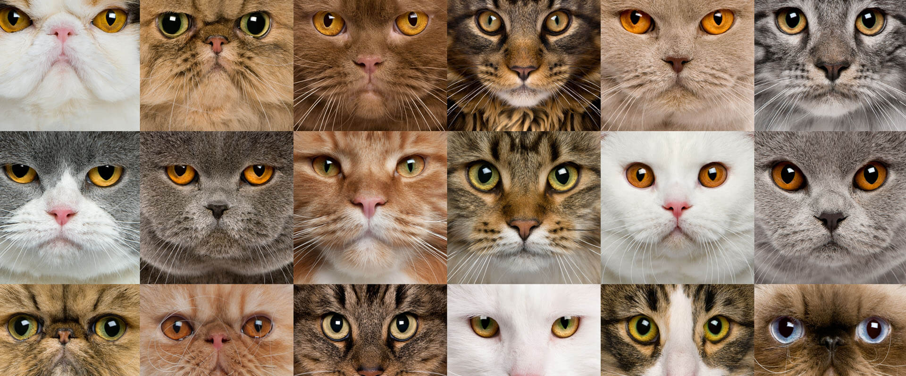

The following list of cat breeds includes only domestic cat breeds and domestic and wild hybrids. The list includes established breeds recognized by various cat registries, new and experimental breeds, landraces being established as standardized breeds, distinct domestic populations not being actively developed and lapsed (extinct) breeds.

As of 2019, The International Cat Association (TICA) recognizes 73 standardized breeds, the Cat Fanciers' Association (CFA) recognizes 45, and the Fédération Internationale Féline (FIFe) recognizes 48.

Inconsistency in breed classification and naming among registries means that an individual animal may be considered different breeds by different registries (though not necessarily eligible for registry in them all, depending on its exact ancestry). For example, TICA's Himalayan is considered a colorpoint variety of the Persian by the CFA, while the Javanese (or Colorpoint Longhair) is a color variation of the Balinese in both the TICA and the CFA; both breeds are merged (along with the Colorpoint Shorthair) into a single "mega-breed", the Colourpoint, by the World Cat Federation (WCF), who have repurposed the name "Javanese" for the Oriental Longhair. Also, "Colo rpoint Longhair" refers to different breeds in other registries. There are many examples of nomenclatural overlap and differences of this sort. Furthermore, many geographical and cultural names for cat breeds are fanciful selections made by Western breeders to be exotic sounding and bear no relationship to the actual origin of the breeds; the Balinese, Javanese, and Himalayan are all examples of this trend.

The domestic short-haired and domestic long-haired cat types are not breeds, but terms used (with various spellings) in the cat fancy to describe "mongrel" cats by coat length, ones that do not belong to a particular breed. Some registries permit them to be pedigreed and they have been used as foundation stock in the establishment of some breeds.[citation needed] They should not be confused with standardized breeds with similar names, such as the British Shorthair and Oriental Longhair. 

***List of cat breeds Natural***

1. Abyssinian
2. Aegean
3. American Shorthair
4. American Shorthair
5. Aphrodite Giant
6. Arabian Mau
7. Asian
8. Brazilian Shorthair
9. British Longhair
10. British Shorthair

***List of cat breeds Mutation***

- American Curl
- American Bobtail
- American Bobtail
- American Curl
- American Ringtail
- American Wirehair
- Cornish Rex
- Devon Rex
- German Rex
- Japanese Bobtail
- LaPerm

