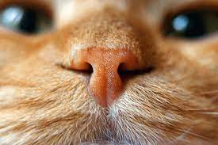

Cats have natural instincts to stalk their prey, trace the smell of an unfamiliar object, and acknowledge their weaknesses so they can better prepare themselves from danger. Cats have great senses which help them scout out their surroundings, identify friend or foe and detect objects in a way that are far beyond what humans are capable of.

Now we will put humans on a test against our opponents, cats, to see who have better senses. I am sure many of you already know the answer, but please read on, maybe something surprise you.

### HEARING

>Cats have incredible hearing skills. In fact, they can hear sounds that even dogs fail to hear. With 2 satellite dish shaped ears, cats' range of hearing goes up to ultrasonic which is superbly high.
>
>Sound is measured by vibrations. The number of vibrations a sound produces per second is called Frequency with a unit measurement named hertz. Cats can hear 100,000 hertz as oppose to their canine counterpart that is receptive to a range from 35,000 to 40,000 hertz. Compare to cats, humans are totally out of their league with a paltry 20,000 hertz, trailing far behind.
>
>*ONE FOR CATS*

### SMELL

>Cats have a fascinating sense of smell. They use their smell to sniff out the whereabouts of a mouse or food smidgens hidden underneath the fridge. Their nose is extremely sensitive to scents because there are approximately 200 million odor-sensitive cells in the nostrils which make cats an adept sniffer.
>
>With only 5 million odor-sensitive cells in humans, our ability to smell is pale in comparison. Cats do not only utilize their olfactory on locating food, but also use it as a medium to communicate. Cats have scent glands on the head and paws. Whenever they rub their head or paws against an object, it is as if they are leaving their business card for other felines to recognize and translate.
>
>*ANOTHER ONE FOR CATS* 

### TOUCH

>Whiskers are an important apparatus for cats to get around. Did you know that besides the whiskers grown on their face, cats have whiskers on the backs of their front legs as well? 
>
>The whiskers aid them in navigating in narrow or shallow areas and tell them whether the area is big enough for their body to get through. The whiskers work as antenna, approximating the measurement of a tight opening, giving them an idea whether they can squeeze through it. This ability provides them good judgment before their curiosity carry them away. Certain cats have short whiskers or even born without any whiskers such as Sphynx. The absence of whiskers does not impede them from performing their normal tasks, but rather they are as agile and nimble as other cats that have long whiskers.
>
>Humans, on the other hand, are not equipped with such natural ability to recognize their surroundings in such cognizant fashion.
>
>*YET ANOTHER ONE :3*

### TASTE

>We all know that cats are persnickety about their food. Dogs on the other hand, would eat almost any treats you offer them. The reason that cats are fastidious eaters is because they only have 473 taste buds whereas humans have around 9,000 taste buds. This explains why cats rely so heavily on their smell when it comes to food.
>
>*FINALLY ONE FOR HUMANS*

### SIGHT

>Cats have superior vision. They can see things in a panoramic view due to their ability to dilate their pupils. Their excellent peripheral vision helps them capture the movement of a mouse or a bird in a much wider range than humans. However, like the humans, cats have a blind spot too. It is situated 4 -5 inches in front of their face, so sometimes they may not see the toy that is placed right underneath their chin.  However, their whiskers will come in handy in case like this.
>
>*BUT AGAIN FOR THE CATS*

***SCORE BACK UP***

Cats WIN!!! 

It is not surprising that cats beat us easily, with a score of 4 vs. 1. They are wonderful and intelligent animals plus cute to be around.