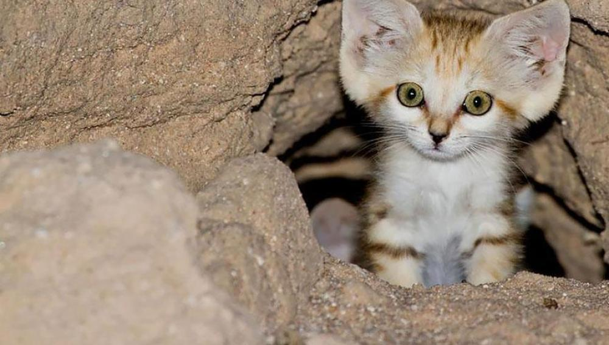

*Felis* is a genus of carnivorous mammals in the family *Felidae*. It traditionally included all living felid species, but is now restricted to five species, including the Eurasian wildcat (*Felis silvestris*), which inhabits much of Eurasia and Africa. The well-known domestic cat (*Felis silvestris catus*) is a subspecies of the latter.

Members of the genus *Felis* are small in size, have long tails and are adapted to hunting small animals such as rodents, birds and reptiles. Despite their low specialization, theirs is one of the most derived branches of the feline evolutionary tree.

### *FELIS CHAUS*

>The jungle, swamp or chaus cat,characteristic of the humid lowlands of southern Asia, from the eastern Mediterranean to Indochina and Malacca. Its range extends northward into Central Asia, following the Caspian Sea coast and the courses of large rivers such as the Amu Darya and Sir Darya. It reaches European Russia at the mouth of the Volga and Africa in the Nile Delta.
>
>In appearance, the jungle cat is reminiscent of a domestic cat with reddish fur, slightly longer ears with a brush on the end (like lynxes, which sometimes earns it the nickname "swamp lynx"), long legs and a somewhat short tail. The length and color of the coat are variable, although in the latter case it is usually a more grayish reddish in the more northern subspecies, while the southern subspecies have a more vivid orange or yellowish coat. Dark stripes are restricted to the legs, face and tail.

### *FELIS MARGARITA*

>The sand or desert cat. It is the smallest member of the Felis genus along with the black-footed cat (*Felis nigripes*). It barely reaches 50 cm in head and body length, to which must be added another 30 cm of tail. The largest males weigh less than 3.5 kg.
>
>It is probably the feline best adapted to life in sandy deserts such as those of the Sahara, Arabia, Iran, Afghanistan, Turkmenistan and Pakistan. In the less arid areas of these regions it coexists with the wildcat (*F. silvestris*), apparently without problems.
 

### *FELIS NIGRIPES*

>The black-footed cat is a small feline. It is solitary and does not adapt well to captivity conditions. It emits hoarse roars similar to those of a lion, but less powerful.
>
>It is endemic to southern Africa, and is found mainly in South Africa, Namibia, rarely in Zimbabwe, and probably in the extreme south of Angola. There are only historical, but not recent records from Botswana.
>
>The black-footed cat is one of the smallest feline species in existence. Adult males weigh between 1.9 kg and a maximum of 2.45 kg. Adult females weigh between 1.3 kg and a maximum of 1.65 kg.
>
>Males reach a length of between 36.7 to 43.3 cm and their tails are between 16.4 to 19.8 cm long. Females are smaller with a total length of 36.9 cm and tails 12.6 to 17.0 cm long.

### *FELIS SILVESTRIS*

>The wildcat, also known as the feral cat or, more formally, the Eurasian wildcat, is a species of wild carnivorous mammal of the felid family that inhabits Eurasia and Africa. It has many subspecies, such as the European wildcat (*Felis silvestris silvestris*), the Asian wildcat (*Felis silvestris ornata*) and the African wildcat (*Felis silvestris lybica*). It can hybridize with domestic cats that have been abandoned in the wild or have become feral.
>
>It is a small-sized feline, and the wild ancestor of domestic cats (*Felis silvestris catus*). Feral cats are generally more robustly built than their domestic relatives. They tend to be predominantly grayish-brown brindle in color, lighter and ochraceous on the belly and underparts, with four longitudinal black stripes on the forehead, which converge in a line that runs along the entire spine.
>
>**Felis silvestris catus:**more commonly called gato, and colloquially minino, michino, michi, micho, mizo, miz, morroño or morrongo.The current name in many languages comes from the Vulgar Latin *catus*. Ironically, *catus* alluded to wild cats, while domestic cats, in Latin, were called *felis*.
>
>As a result of genetic mutations, cross-breeding and artificial selection, there are numerous breeds. Some, such as the sphynx or peterbald breeds, are hairless; others are tailless, such as the manx cats, and some have atypical colorations, such as the so-called blue cats.

### *FELIS LUNENSIS*

>Martelli's cat (*Felis lunensis*) is an extinct species of carnivorous mammal of the Felidae family. *Felis lunensis* is one of the earliest species of *Felis*, appearing 2.5 million years ago in the Pliocene. Its fossils have been found in Italy and Hungary.
>
>The holotype of the first specimen was described by the Italian naturalist Ugolino Martelli in 1906 and is currently preserved at the University of Florence in Italy.

