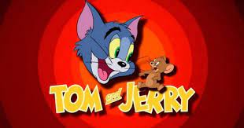

Society has always liked cats, if not tell the Egyptians who had them as gods. 
The human being has tried to immortalize them either in movies, theater or photographs.

That is why in this post we will compile a brushstroke of its cinematographic history with the most famous cats.

### FILMS

>Nowadays, there are many movies and series with cats. But in this section we will share some of the most famous movies with cats as main characters.
>
>**Aristocats:** With the help of a smooth talking tomcat, a family of Parisian felines set to inherit a fortune from their owner try to make it back home after a jealous butler kidnaps them and leaves them in the country
>
>**Puss in boots:** Puss in boots is a well-known story by Charles Perrault, about the third and the youngest son who gets the worse part of the inheritance, almost nothing. That son got a cat for which was believed to be useless.
>
>In this fairytale, the main character, Cat, presents the qualities of a younger son which are intelligence, bravery, and wittiness. The moral of the story is that a man should always rely on his abilities and that it is important to believe in yourself and be the creator of your luck.
>
>Nowdays there are few movies where this cat have many adventures with friends, and crossover with other movies.
>
>**Tom and jerry:** Are two animated characters, a cat (Tom) and a mouse (Jerry), who starred in a large number of short films, series and films. This iconic duo is known since 1940, and continues entertaining with their adventures.
>
>**A stray cat named Bob:** The true feel-good story of how James Bowen, a busker and recovering drug addict, has his life transformed when he meets a stray ginger cat. Based on the international best selling book.
>
>**A whisker away:** In the world of Anime, japanese animation, Miyo Sasaki is in love with her classmate Kento Hinode and tries repeatedly to get Kento's attention by transforming into a cat, but at some point, the boundary between herself and the cat becomes ambiguous.
>
>**Catwoman:** In the world of heros and villians there is catwoman. 
>A shy woman, endowed with the speed, reflexes, and senses of a cat, walks a thin line between criminal and hero, even as a detective doggedly pursues her, fascinated by both of her personas.
>
>**Garfield:** Garfield, the fat, lazy, lasagna lover, has everything a cat could want. This cat like Tom & Jerry has a lot of movies and series telling his advetures.

### THEATER

>As in the movies, cats have also been represented in theaters. Although humans cannot convey the cutness of the cats, we try.
>
>We will highlight 2 very well known plays.
>
>**Cats**: Is a sung-through musical composed by Andrew Lloyd Webber, based on the 1939 poetry collection Old Possum's Book of Practical Cats by T. S. Eliot. 
>
>It tells the story of a tribe of cats called the Jellicles and the night they make the "Jellicle choice" by deciding which cat will ascend to the Heaviside layer and come back to a new life. As of 2022, Cats remains the fourth-longest-running Broadway show and the sixth-longest-running West End show.
>
>**The Lion King** Based on the 1994 Disney animated feature film of the same name and William Shakespeare’s Hamlet, The Lion King is the story of Simba, an adventurous and energetic lion cub who is next in line to be king of the Pride Lands, a thriving and beautiful region in the African savanna.
 

### FAMOUS CATS

>Finally in this section we will highlight some cats, that although they have not been protagonists of their movies, series have left their mark in our memory.
>
>Here are some of them:
>
>**Salem:** fictional character from the U.S. comic book series Sabrina the Teenage Witch. 
>
>He is a talker American Shorthair cat who lives with Sabrina, Hilda and Zelda Spellman in the fictional town of Greendale, located near Riverdale.
>
>**Sylvester:** Black and white antropomorphic cat with a red nose.
>
>In most of his stories his goal is to hunt Tweety (the canary). The attempts are always unsuccessful, and Silvestre is punished by his owner, a nice grandmother.
>
>The following two belong to the simpsons animated series
>
>**Snowball II:** Snowball II was the second cat in the Simpsons Family, named after Snowball I.  Although Snowball had white fur, which obviously inspired his name, Snowball II is black.
>
>**Itch:** Like Snowball II belongs to the Simpsons Family, but this time this cat takes part of a tv show within the series itself. 
>
>**Chesire:** known mainly for appearing in Lewis Carroll's Alice in Wonderland, which is distinguished mainly by being smiling all the time.
>
>Has the ability to appear and disappear at will, entertaining Alice through paradoxical conversations with philosophical overtones.
>
>**Doraemon:** Appears in a japanese tv show, where it's a future cat without ears of the XXII century that lives in a present Japan helping a boy called Novita in his daily life.
>
>**Si & Am:** Are supporting antagonists in Disney's film Lady and the Tramp. They are a sinister pair of Siamese cats, who relish in causing mischief wherever they can.
>
>Also big cats like:
>
>**Tiger:** Is a fictional character, an anthropomorphic stuffed tiger. Appears in the Disney cartoon versions of the Winnie the Pooh stories. 
>
>He is known for his distinctive orange and black stripes, large eyes, a long chin, a springy tail, and his love of bouncing.
>
>**Mufasa & Simba:** Father and son of the famous film The Lion King.
>
>**Baguera & Shere kan** Baguera as a black panther helps Mowgly in The jungle book, and Shere Kan a wild tiger that tries to hunt the child.
>
>**Rajah:** A frindly big tiger that appears in Aladdin's movie, beside the Jasmine princess, such as her pet.

To sum up, the cats are portrayed in many different ways like we've seen in this post.

We are left with the fact that they are an essential, if not adorable, part of our society. 

### THAT'S ALL FOLKS

